# Seta Agent Platform 🚀

[](LICENSE)
[](CONTRIBUTING.md)
[](https://nodejs.org)
[](https://pnpm.io)
[](https://www.typescriptlang.org)

**The open-source foundation for building production-grade autonomous agents — purpose-built for teams who want to ship a working AI system, not wrestle with infrastructure.**

Seta Agent Platform is a multi-tenant, modular monolith that ships with everything a Hackathon team needs out of the box: a streaming chat UI, a three-tier agent supervisor powered by [Mastra](https://mastra.ai), RBAC-gated tool execution, human-in-the-loop approval flows, a transactional event bus, and vector search via pgvector — all in a single Postgres database. You bring your domain; the platform brings the runtime.

> **Hackathon quick-start:** Clone → `pnpm install` → `pnpm db:up` → `pnpm db:migrate` → `pnpm db:seed` → `pnpm dev`. See [§5 — Getting Started](#5-getting-started--contributing) for the full walkthrough.

---

## Table of Contents

1. [System Architecture (The Foundation)](#1-system-architecture-the-foundation)
2. [Pre-built Base: Why Build on Top of This?](#2-pre-built-base-why-build-on-top-of-this)
3. [How to Build Your Custom Agent](#3-how-to-build-your-custom-agent-extensibility-guide)
4. [Agent Execution Flow (Under the Hood)](#4-agent-execution-flow-under-the-hood)
5. [Getting Started & Contributing](#5-getting-started--contributing)

---

## 1. System Architecture (The Foundation)

### Overview

The platform is a **modular monolith**: a single Postgres database, a single Docker image, and two Node.js runtimes (`apps/server` and `apps/worker`) that share all domain modules in-process. Module isolation is enforced by Postgres schemas and TypeScript static analysis — not by network boundaries. This keeps cross-module calls typesafe, eliminates network latency between services, and means one backup/failover covers the entire system.

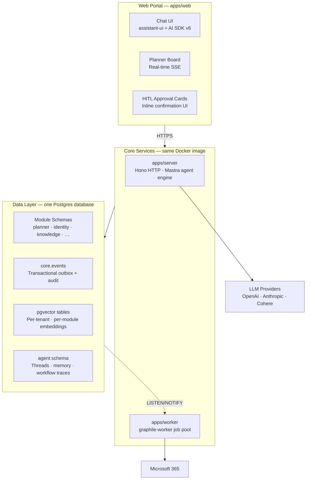

### Data Layer & Multi-Schema Architecture

Every feature module owns **one Postgres schema** (`planner`, `identity`, `knowledge`, `agent`, …). Cross-schema foreign keys are **prohibited** — module boundaries are crossed only through the event outbox or typed public-surface function calls. Vector embeddings (`pgvector`) live as per-tenant tables within each module's schema — no separate vector database needed.

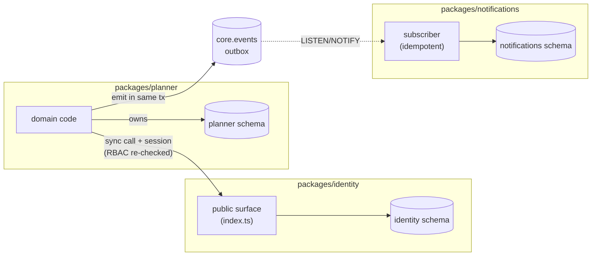

### Services & Communication

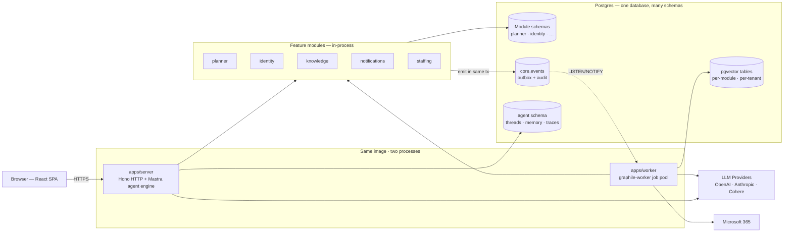

**Key communication patterns:**

| Pattern | How it works |
|---|---|
| **Synchronous module calls** | Typed function calls with a `SessionScope` — RBAC re-checked at the callee |
| **Async events (outbox)** | State change + event emission commit in one transaction — no lost or phantom events |
| **Worker dispatch** | `LISTEN/NOTIFY` wakes subscribers; 2 s poll fallback covers dropped notifies |
| **Agent → module** | Agent tools call module public-surface functions — writes always require HITL approval |

---

## 2. Pre-built Base: Why Build on Top of This?

### Overview

Rather than wiring up auth, a database, a chat UI, a job queue, and an LLM runtime from scratch, Seta gives your team a **working foundation** on day one. The platform handles tenancy, sessions, permissions, streaming chat, tool approvals, vector search, and event sourcing. Your team writes domain logic.

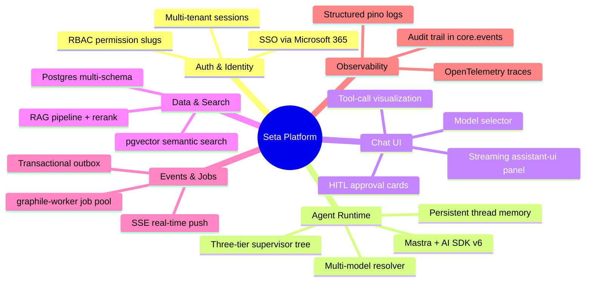

### Web / Frontend Base

The frontend (`apps/web`) is a React 19 SPA built with TanStack Router, TanStack Query, shadcn/ui, and Tailwind 4. Out of the box it ships:

| Surface | What you get |
|---|---|
| **Chat panel** | Streaming `assistant-ui` panel; supports markdown, tool-call cards, and HITL approval cards |
| **Agent approval cards** | Inline approval UI derived automatically from tool input schemas |
| **Planner board** | Multi-tenant task/plan management with real-time SSE updates |
| **Module shell** | Navigation is declarative — each module exports a `navManifest` and the shell registers it automatically |
| **Model selector** | `auto` tier lets the server pick the optimal LLM; manual override available |

### Mastra Agent Core

The agent engine (`packages/agent/`) is built on [Mastra](https://mastra.ai) and composes a **three-tier supervisor tree** at boot:

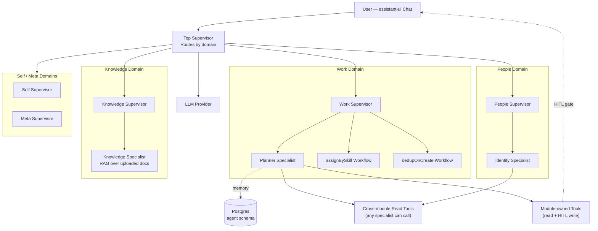

| What you get for free | Detail |
|---|---|
| **Intent routing** | Top supervisor picks domain; domain supervisor picks specialist or workflow |
| **Persistent memory** | Threads and messages in `agent` schema via `@mastra/pg` |
| **HITL gate** | Every write tool surfaces an approval card before executing |
| **Audit trail** | Every tool call, approval, and workflow step recorded in `core.events` and `agent.workflow_runs` |
| **Rate limiting** | Per-tenant/user token budget; returns HTTP 429 with `Retry-After` |
| **Multi-model support** | Auto-selects from configured OpenAI / Anthropic models by tier hint |

---

## 3. How to Build Your Custom Agent (Extensibility Guide)

### Overview

Adding a new agent capability is a **pure addition** — scaffold a module, implement domain logic, register tools, and the runtime picks everything up at boot. No existing code changes. The path from scaffold to a working agent tool is approximately 30 minutes.

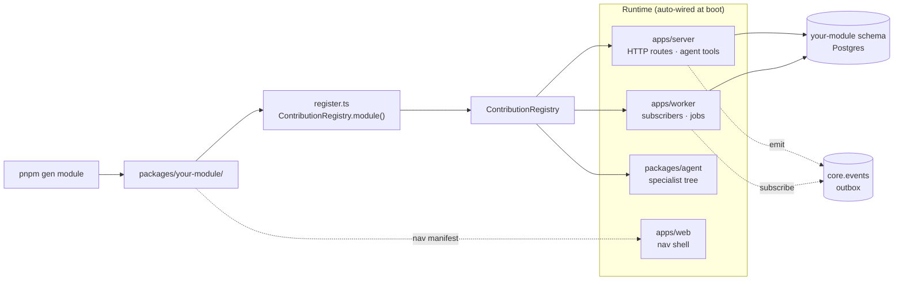

### Extension Point 1 — Agent Persona & System Prompt

A specialist is a named agent persona scoped to one domain. Register it in your module's `register.ts` via `AgentRegistry.registerSpecialist()`. The `instructions` field is your system prompt; the `domain` field controls which supervisor tree branch it lives under.

**Where to work:** `packages/<your-module>/src/register.ts`

Available domains:

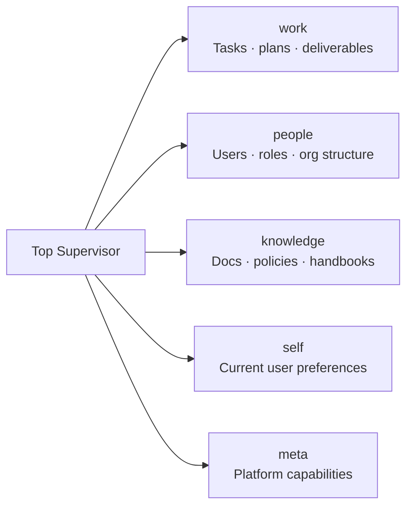

Adding a specialist to an existing domain requires **no changes** to the top router prompt — you only change your own module.

### Extension Point 2 — Custom Tools (Function Calling)

Tools are the primitives your specialist calls to read data or propose actions. They live in `packages/<your-module>/src/backend/agent-tools/` and are authored with `defineAgentTool` from `@seta/agent-sdk`.

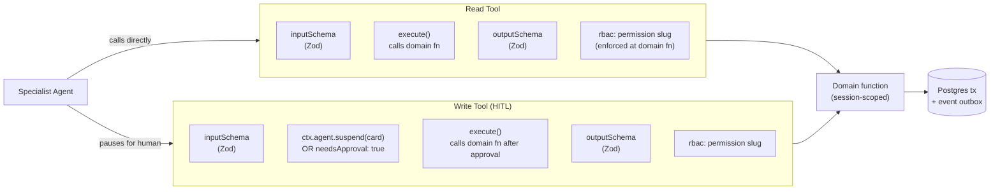

**Tool description rules** — the LLM reads the description to decide which tool to call:

| Rule | Example |
|---|---|
| Start with an imperative verb | `"List open deals…"` not `"This tool retrieves…"` |
| Name the entity and scope | `"…for the current user, filtered by stage"` |
| Add inline constraints | `"Hours are decimal (e.g. 1.5)"` |
| Use `.describe()` on schema fields | Keep tool description concise |

### Extension Point 3 — Intent Recognition

Intent routing is driven entirely by natural-language descriptions — no classifiers to train.

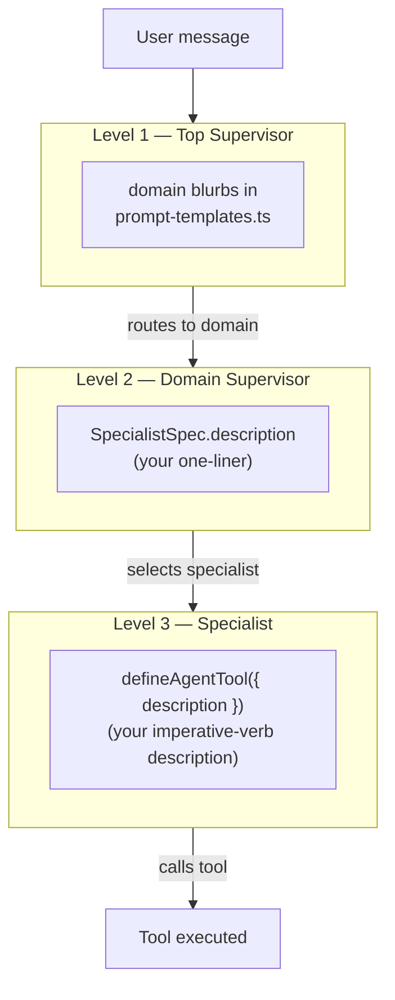

Only add a new domain entry to `prompt-templates.ts` if you need a completely new routing bucket. Adding a specialist to an existing domain or adding a new tool to a specialist requires **zero routing changes**.

### Module Folder Structure

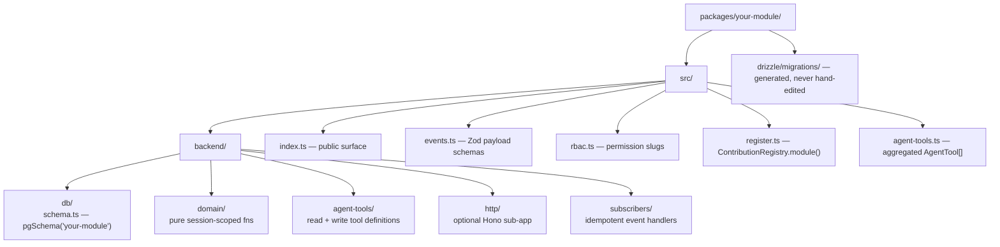

---

## 4. Agent Execution Flow (Under the Hood)

### Overview

Every user message travels through a deterministic chain: the HTTP route validates the session and deducts the rate-limit budget, the top supervisor routes to a domain, the domain supervisor picks a specialist or workflow, the specialist reasons over its tools, read tools execute immediately, write tools pause for user approval, and after approval the domain function commits state and emits an event — which the worker fans out to subscribers (notifications, audit, integrations).

### Step-by-Step Lifecycle

| Step | What happens |
|---|---|
| **1. Intent Parsing** | User sends a message to `POST /api/agent/v1/chat`. The route injects page context, validates the session, and calls `reserveTurn` to deduct the token budget. |
| **2. Domain Routing** | The top supervisor reads the message and delegates to exactly one domain (`work`, `people`, `self`, `knowledge`, or `meta`). |
| **3. Specialist Selection** | The domain supervisor picks the right specialist or triggers a deterministic workflow. |
| **4. Context Loading (RAG)** | The specialist calls read tools or semantic search tools to load relevant context. |
| **5. Orchestrator Processing** | The specialist reasons over the fetched signals and decides which action to propose. |
| **6. HITL Gate** | Write tools call `ctx.agent.suspend(card)` or set `needsApproval: true`. The stream pauses; an approval card renders in the chat UI. |
| **7. User Approval** | The user approves. The client posts `POST /api/agent/v1/chat/approve` with optional `resumeData`. |
| **8. Tool Execution** | The domain function runs inside `withEmit(session, ...)`: the DB write and domain event commit in one transaction. |
| **9. Response Generation** | The agent receives the tool result, generates a confirmation message, and streams it back. |
| **10. Event Fan-out** | `LISTEN/NOTIFY` wakes the worker; subscribers process the event idempotently (notifications, audit, integrations). |

### Sequence Diagram

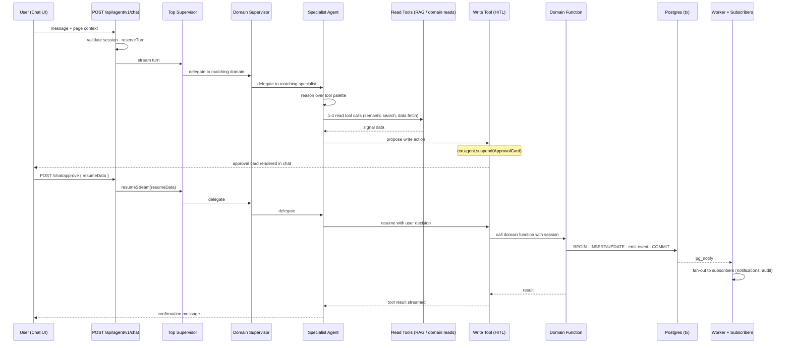

### HITL State Machine

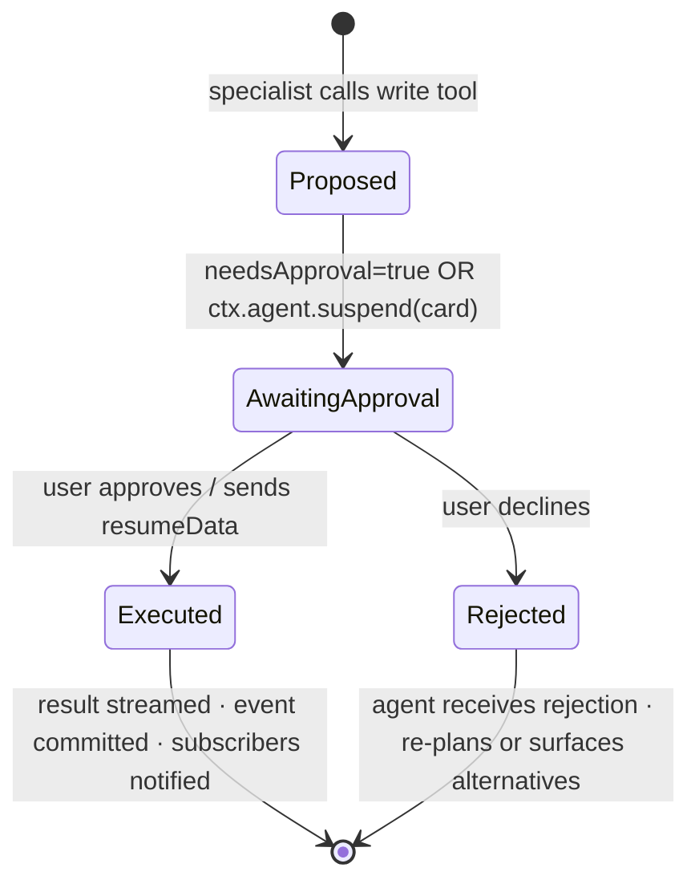

---

## 5. Getting Started & Contributing

### Prerequisites

- **Docker** — for Postgres + observability stack
- **Node.js 24 LTS** — `nvm use 24` or `fnm use 24`
- **pnpm 9** — `npm install -g pnpm`

### Local Development Setup

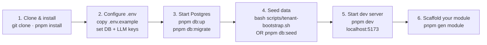

```bash
git clone https://github.com/Seta-International/agent-platform.git
cd agent-platform
pnpm install
cp .env.example .env        # fill in DATABASE_URL, OPENAI_API_KEY, BETTER_AUTH_SECRET
pnpm db:up
pnpm db:migrate
bash scripts/tenant-bootstrap.sh   # admin@sandbox.test / ChangeMe@2026
pnpm dev
```

> **Full demo dataset (300 users + plans + tasks):** use `pnpm db:seed` instead of `tenant-bootstrap.sh`. Sign in as `thang.tran@setafutureorg.onmicrosoft.com` / `ChangeMe@2026`.

### Verification

```bash
pnpm typecheck   # strict TypeScript across all workspaces
pnpm lint        # dep-cruiser boundary gates + ESLint + Biome
pnpm test        # unit + integration tests (real Postgres via testcontainers)
pnpm test:e2e    # Playwright end-to-end (if UI changed)
```

### How to Contribute

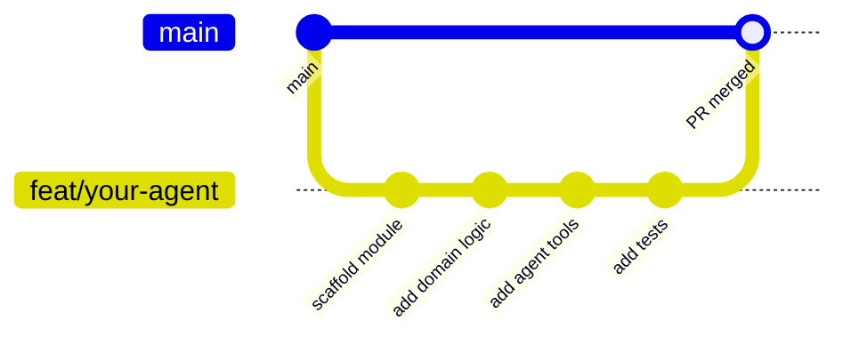

Branch naming: `feat/` · `fix/` · `chore/` · `refactor/` · `docs/` · `test/`

Commit style — imperative mood: `feat: add sales pipeline agent tool`

**Pull Request checklist:**

- [ ] `pnpm typecheck` and `pnpm lint` pass
- [ ] `pnpm test` passes — write failing tests first
- [ ] Write tools have HITL approval enabled
- [ ] Domain functions are session-scoped and re-check permissions at the callee
- [ ] State changes and event emissions share one transaction
- [ ] No cross-schema foreign keys; no cross-module internal imports

**Reporting issues:** Use `.github/ISSUE_TEMPLATE/`. For security vulnerabilities, follow `SECURITY.md` — do not open a public issue.

---

## Workspace Reference

| Package | Purpose |
|---|---|
| [`apps/web`](apps/web) | React 19 SPA — planner, agent chat, console admin |
| [`apps/server`](apps/server) | Hono API; dev also runs the dispatcher + worker pool |
| [`apps/worker`](apps/worker) | Production graphile-worker pool + LISTEN/NOTIFY dispatcher |
| [`apps/cli`](apps/cli) | Operational CLI — migrate, seed, provision, embedding backfill |
| [`packages/core`](packages/core) | Outbox, event bus, dispatcher, runtime composition |
| [`packages/identity`](packages/identity) | Users, sessions, SSO, role grants |
| [`packages/planner`](packages/planner) | Plans, buckets, tasks; Microsoft Planner sync |
| [`packages/knowledge`](packages/knowledge) | Tenant knowledge corpus + RAG pipeline |
| [`packages/notifications`](packages/notifications) | In-app + email prefs, SSE hub |
| [`packages/agent`](packages/agent) | Mastra engine + agent factory (engine-only; no feature imports) |
| [`packages/staffing`](packages/staffing) | Orchestrator: cross-module workflows |
| [`packages/shared-ui`](packages/shared-ui) | Design system — tokens, primitives, the only `.css` |
| [`sdks/agent`](sdks/agent) | `@seta/agent-sdk` — agent-tool authoring contract |
| [`sdks/module`](sdks/module) | `@seta/module-sdk` — frontend nav-manifest contract |

## Scripts

| Script | Purpose |
|---|---|
| `pnpm dev` | Run every app with HMR |
| `pnpm build` | Production build across the workspace |
| `pnpm typecheck` | TypeScript project references |
| `pnpm test` | Vitest against real Postgres via testcontainers |
| `pnpm test:e2e` | Playwright against the dev stack |
| `pnpm lint` | dep-cruiser + Biome + style + raw-SQL boundary checks |
| `pnpm gen module` | Scaffold a new module |
| `pnpm db:reset` | Drop, recreate, migrate, and reseed the dev DB |

---

## License

[MIT](LICENSE) © Seta International
