# Copilot agent architecture

*The assistant that catches duplicate tasks, suggests assignees, and routes every write through a human approval.*

---

## TL;DR

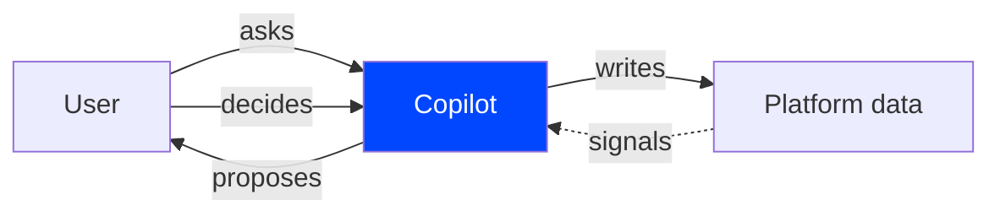

**One sentence:** the agent proposes, the user decides, the platform records.

| What ships in v1 | Value |
|---|---|
| Chat over all platform data (Work / People / Self / Meta) | One surface, no context switching |
| **Dedup at task creation** — vector similarity + approval card | Cuts duplicate noise at the source |
| **Skill-match assignee suggestions** — skills + load + capacity + tz | Assignment is one click, not a meeting |
| HITL approval on every write | Audit trail by construction, no surprises |
| Built on [Mastra](https://mastra.ai) | ~80% of the runtime is bought, not built |

---

## What the user sees

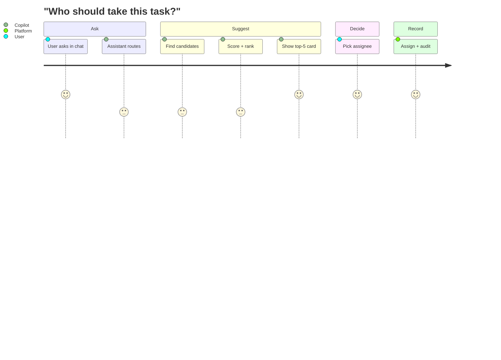

```mermaid
journey
    title "Create a task" (with dedup catch)
    section Draft
      Type title: 5: User
    section Check
      Vector search: 3: Copilot
      Classify match: 3: Copilot
    section Decide
      Show duplicates card: 5: Copilot
      Pick "Comment on #142": 5: User
    section Record
      Comment + audit: 5: Platform
```

Both flows share the same contract — **propose, decide, record** — and the same approval card surface.

---

## Topology

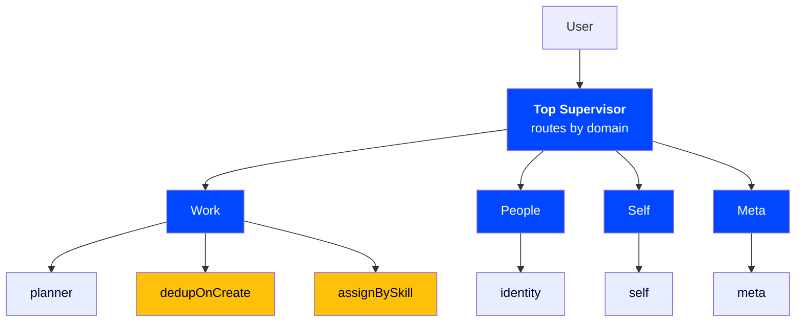

| Layer | Job | Why |
|---|---|---|
| **Top Supervisor** | Pick a *domain* | Routing accuracy collapses past ~10 options. Domain layer keeps it small forever. |
| **Domain Supervisor** | Pick a specialist or invoke a workflow | Module-level coordination without polluting the top router |
| **Module Specialist** | Run module-specific tools | Owns its writes. Reads across modules through a shared registry. |
| **Workflow** | Multi-step deterministic flows (e.g. dedup, assign) | Reasoning is for chat; ordered side-effects belong in a workflow |

**Design rule:** *writes are private, reads are shared.* A specialist can read timesheet capacity without bouncing the request back to a timesheet specialist — one delegation hop, clean audit trail.

### Why hierarchical, not flat

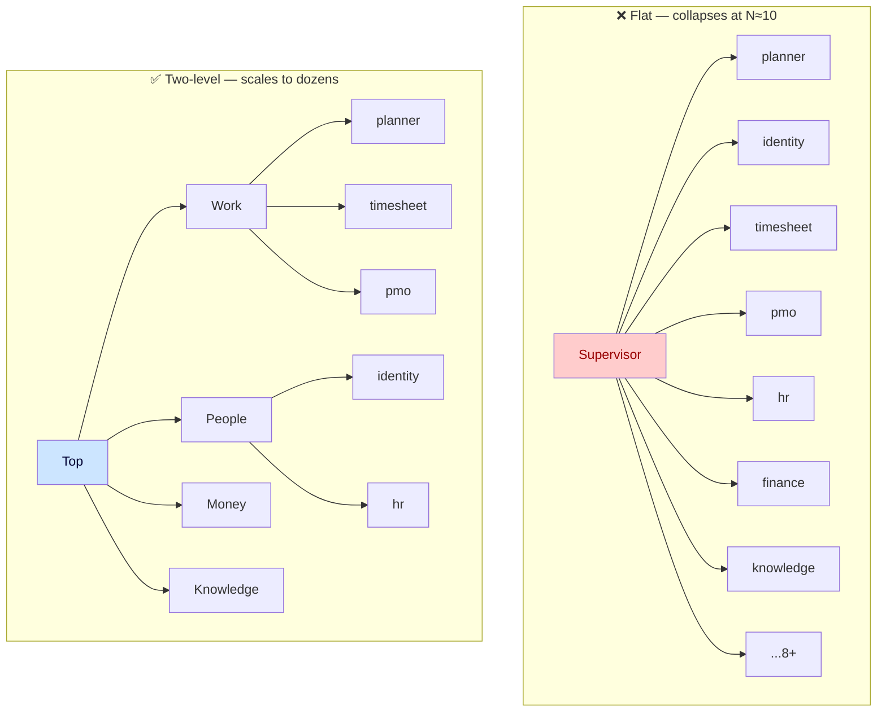

| | Flat | Hierarchical |
|---|---|---|
| Routing prompt size | grows linearly with modules | stays small forever |
| Routing accuracy at N=15 | ~70% | ~95% |
| Adding a module | tunes the whole prompt | adds a sub-agent under its domain |

### Tool taxonomy

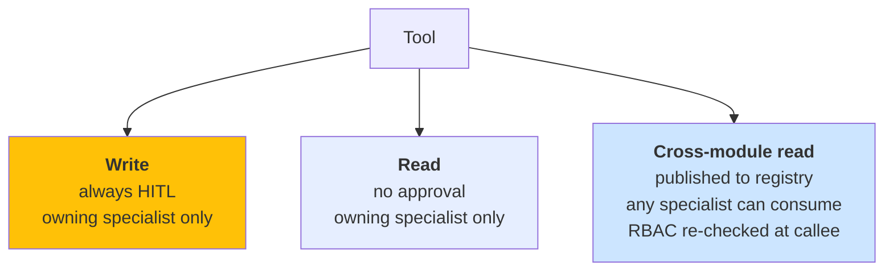

| Category | HITL | Visibility | Example |
|---|---|---|---|
| Write | ✅ | Owning specialist | `planner_assignTask`, `identity_updateMyDisplayName` |
| Read | — | Owning specialist | `planner_getTask`, `identity_whoAmI` |
| Cross-module read | — | Any specialist (RBAC-gated) | `timesheet_getCapacityThisWeek`, `identity_getTimezoneForUser` |

---

## How a request travels

### Read path (no approval)

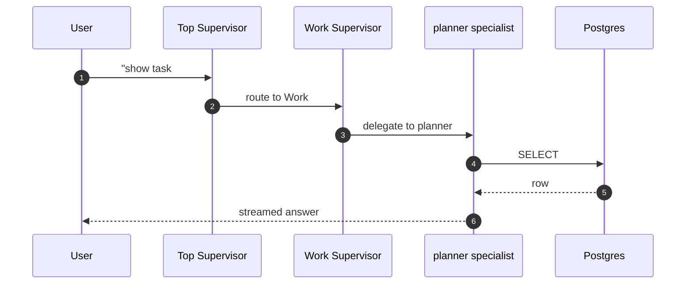

### Write path (with HITL)

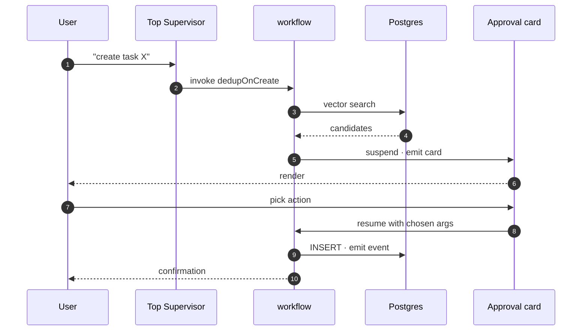

Same shape regardless of depth: any write-tool, anywhere in the tree, suspends to a card and resumes on the user's decision.

---

## Two flagship workflows

### 🪣 Dedup on create

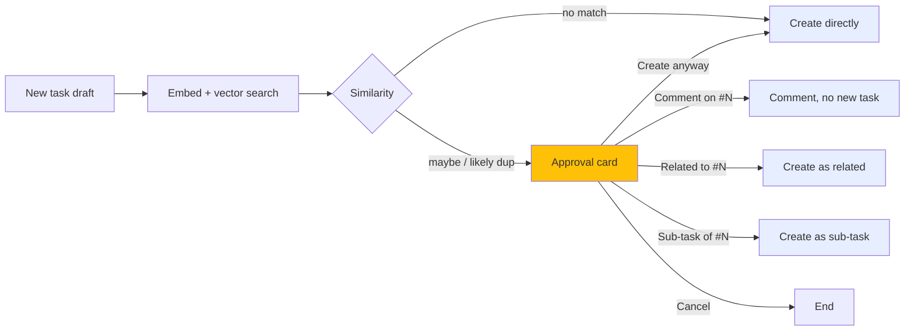

| Aspect | Behavior |
|---|---|
| **Why it exists** | Duplicate tickets are silent tax: same triage three times, fragmented context, lopsided backlogs |
| **Thresholds** | Per-tenant tunable. Loose for consulting (many similar client tickets), strict for product teams |
| **Bulk import** | Same logic, log-only mode — no approval cards on a 1,000-row CSV |
| **Cost** | Reads only; embedding is in-memory until the user decides |

### 🎯 Skill-match assignment

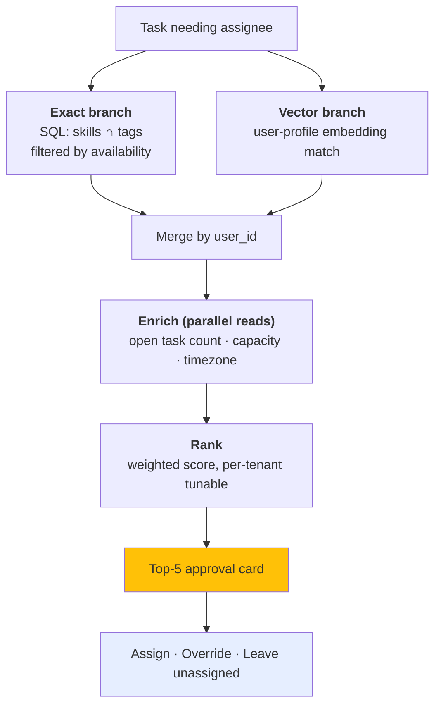

**Candidate signal sources** — every candidate carries at most five signals:

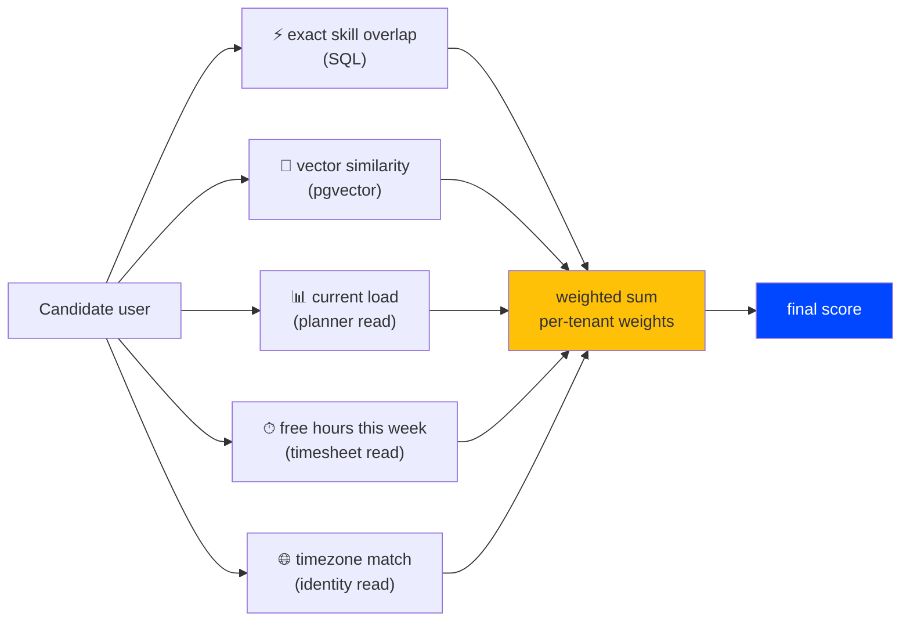

**Cross-module reads in action** — the workflow doesn't know which module supplied which signal:

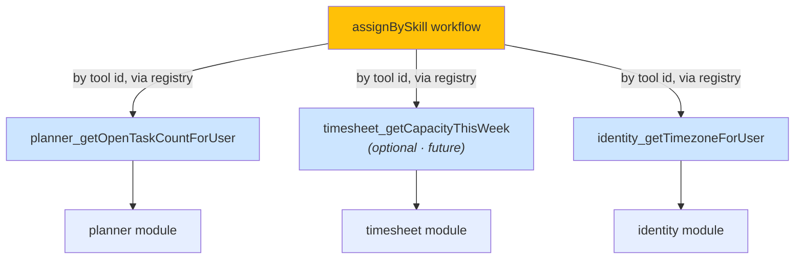

| Aspect | Behavior |
|---|---|
| **Triggers** | Chat ("who should take #142"), auto-suggest after creation, planner UI button |
| **Signals used** | Exact tag overlap · vector similarity · current load · free hours · timezone overlap |
| **Tunable per tenant** | Score weights between the five signals |
| **Auto-assign** | Never. Agent suggests, user assigns. Non-negotiable. |
| **Graceful degradation** | Timesheet absent → capacity column shows `?`. No embedding → exact overlap still works. No tags → vector carries via description. |

---

## The HITL guarantee

> **Every write tool in the system requires explicit user approval. No exceptions, no "low-risk" bypasses.**

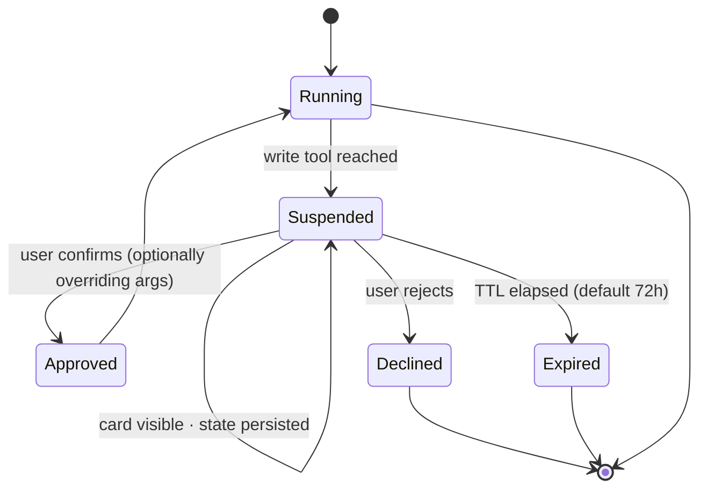

**Anatomy of an approval card:**

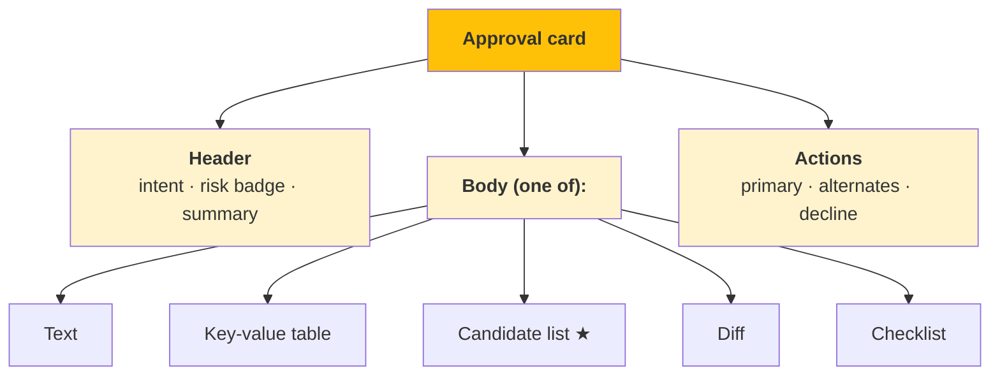

| Card layout | Used by |
|---|---|
| **Text** | Simple confirmations |
| **Key-value table** | Field changes |
| **Candidate list** ★ | Dedup duplicates, assignment suggestions |
| **Diff** | Edits to existing entities |
| **Confirmation checklist** | Destructive operations |

**How alternates work** — picking "Assign to Bob" instead of the top suggestion just patches the tool's arguments:

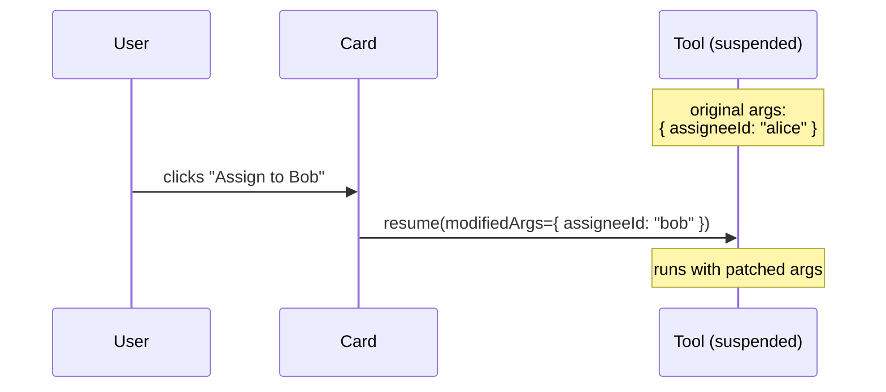

**Persistence**: cards survive refreshes, logouts, restarts. The user can act tomorrow morning on a card from this afternoon. Auto-decline after 72h with an audit row.

**Audit**: every approval, decline, override, and expiry writes to the same outbox the domain events use. One unified history.

---

## Built on Mastra

We didn't write the runtime. [Mastra](https://mastra.ai) ships hierarchical supervisors, tool calling, suspension/resume for HITL, workflow orchestration, vector retrieval, and conversation memory as TypeScript primitives.

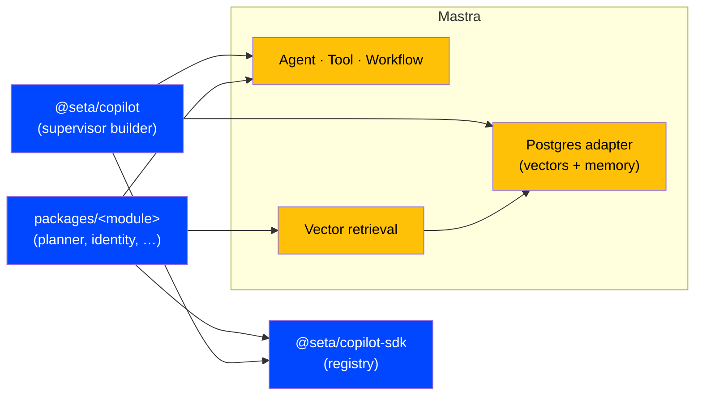

| What we get from Mastra | What we add |
|---|---|
| Agent hierarchy + delegation | Domain ↔ module mapping rules |
| Native HITL suspend/resume | Typed approval card schema |
| Workflow engine | Two flagship workflows + their tunables |
| Vector retrieval + reranker | Per-tenant weights |
| Conversation memory persistence | Module-owned registry seam |
| OpenTelemetry traces | Dashboards + per-workflow quality metrics |

**Boundary in one line:** modules speak to the registry, the engine reads the registry and builds Mastra agents. Neither imports the other.

---

## Retrieval — vectors for one thing only

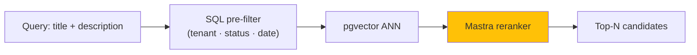

**Vectors are a derived index, never the source of truth.** Anything that admits an exact match (IDs, status, dates, RBAC, exact tags) stays in Postgres. We use vectors for *fuzzy match that exact match would miss* — "Safari login broken" ≈ "OAuth redirect Safari", "auth experience" ≈ "OAuth specialist".

**Hybrid always.** SQL filter is pushed into the same pgvector call, then Mastra's reranker produces the final order. No hand-written scoring formulas.

**Sync is event-driven** — source of truth never gets out of step with the index:

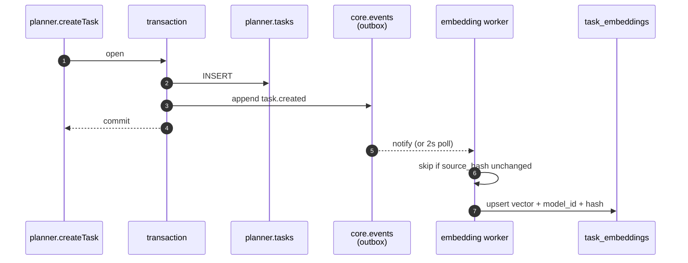

| Property | How |
|---|---|
| **Idempotent** | Keyed on event id; safe to redeliver |
| **Skip-when-unchanged** | `source_hash` comparison before re-embed |
| **Model-upgrade safe** | `model_id` column → backfill filters on stale rows only |
| **Delete safe** | Source delete → cascade to embedding row |

---

## Operational story

### Observability — measured at every layer

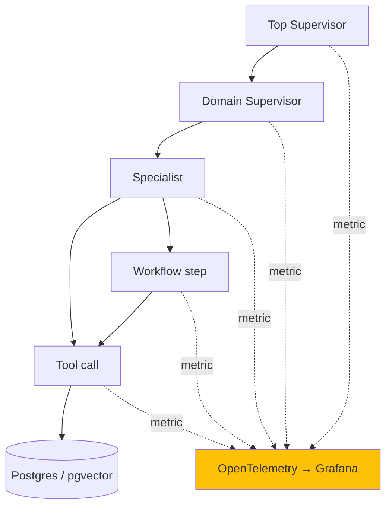

Every box reports latency + token cost. When "the assistant feels slow", we can name the layer.

### Audit — one chronological tape

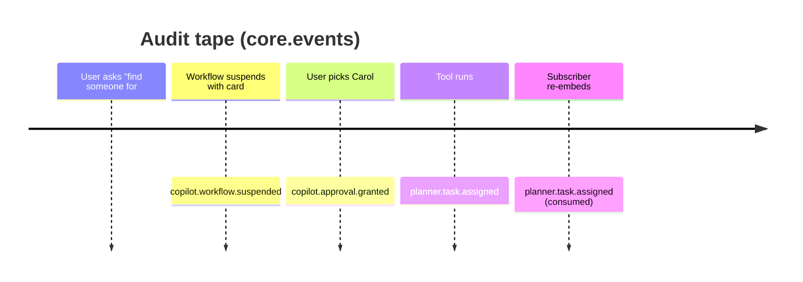

| Concern | How we handle it |
|---|---|
| **Audit** | Every approval, tool call, and workflow run → `core.events`. Same outbox as domain events. |
| **Resilience** | Conversation + suspended runs persist in Postgres. No in-memory state lost to restarts. |
| **Safety rails** | Delegation depth cap (≤4 hops), loop detection, per-tenant step budget. Runaway → structured error, never wall-clock timeout. |
| **Evaluation** | Three layers: tool integration tests · workflow golden-trace replays · agent routing + e2e evals. Merge-gating + nightly. |

### Eval bar (merge-gating)

```mermaid
graph LR
    T["<b>Tools</b><br/>integration tests<br/>real Postgres"]
    W["<b>Workflows</b><br/>golden-trace replays<br/>dedup P≥0.90, R≥0.80"]
    A["<b>Agents</b><br/>routing 50 prompts ≥95%<br/>e2e 20 flows ≥90%"]

    T --> Merge[merge gate]
    W --> Merge
    A --> Merge

    style Merge fill:#0047FF,color:#fff
```

---

## How this absorbs the next module

```mermaid
graph LR
    M["new module<br/>(e.g. timesheet)"]
    R["registry"]
    S["supervisor tree"]

    M -->|"<b>1.</b> register specialist"| R
    M -->|"<b>2.</b> publish cross-module reads"| R
    R -->|"<b>3.</b> rebuild on next boot"| S

    style M fill:#0047FF,color:#fff
    style R fill:#E6EEFF
    style S fill:#FFC107
```

Three actions, none of them touch the copilot package. The new specialist appears under its domain on the next process restart; existing specialists immediately gain access to whatever reads the new module published. This is the property that lets the platform grow without a coordination tax on the copilot team.

---

## What's deferred

| Item | Why | Un-defer when |
|---|---|---|
| Dedup on **update** | Noisy signal — every keystroke would fire a card | Duplicate-create rate stays above zero after v1 |
| **Knowledge domain** (RAG over docs / wiki) | Substantial separate slice (chunking, ingestion, graph-RAG) | Roadmap M3; will use Mastra's `MDocument` + `createGraphRAGTool` |
| **Learning loop** (retune weights from accept/reject) | Needs LLM-as-judge eval infrastructure first | Eval infra lands in M3 |
| **Slack / email approval surfaces** | In-app card pattern needs to bed in first | After v1 launches with steady usage |
| **Auto-assignment** | Policy decision — agent suggests, user assigns | Never |

Full deferred table: [`docs/superpowers/specs/2026-05-25-supervisor-refactor-umbrella-design.md`](superpowers/specs/2026-05-25-supervisor-refactor-umbrella-design.md) §12.

---

## References

- **Spec**: [`docs/superpowers/specs/2026-05-25-supervisor-refactor-umbrella-design.md`](superpowers/specs/2026-05-25-supervisor-refactor-umbrella-design.md)
- **Implementation plans**: `docs/superpowers/plans/2026-05-25-supervisor-refactor-pr{1,2,3}-*.md`
- **Mastra**: [supervisor agents](https://mastra.ai/docs/agents/supervisor-agents) · [approval propagation](https://mastra.ai/docs/agents/agent-approval) · [vector query tool](https://mastra.ai/reference/tools/vector-query-tool)
- **Repo-wide**: [`architecture.md`](architecture.md) · [`creating-modules.md`](creating-modules.md)
